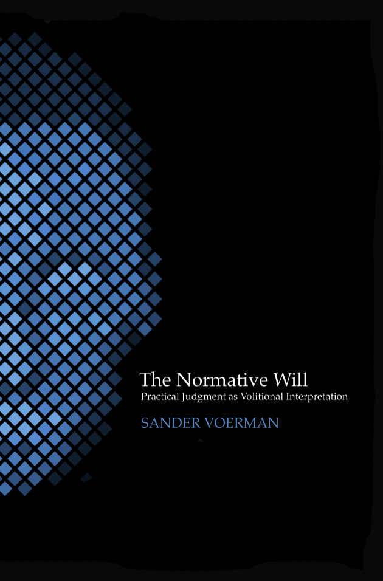

## Redesigning Psychiatry

### Volume 2: Samen innoveren voor het welzijn van toekomstige generaties

[{:style="width: 100px"}][rp2]

(Collaborative innovation for the well-being of future generations).
Report (Dutch, 102 pages).
With Femke de Boer et al.
Amsterdam: Redesigning Psychiatry, 2018.

### Volume 1: Innoveren voor psychisch welzijn in de 21e eeuw

[{:style="width: 100px"}][rp1]

(Innovating for mental well-being in the 21st century).
Report (Dutch, 76 pages).
With Femke de Boer et al.
Amsterdam: Redesigning Psychiatry, 2016.

## The Normative Will

### Practical Judgment as Volitional Interpretation

[{:style="width: 100px"}][nw]

PhD thesis (354 pages). Tilburg: Tilburg University, 2012.

## Vrije wil

### Discussies over verantwoordelijkheid, zelfverwerkelijking en bewustzijn

[{:style="width: 100px"}][vw]

(Free will. Discussions on responsibility, self-realization and consciousness).
Textbook (Dutch, 216 pages). With Tjeerd van de Laar. Rotterdam: Lemniscaat, 2011.

[rp2]: assets/pdf/rp2.pdf
[rp1]: assets/pdf/rp1.pdf
[nw]: assets/pdf/tnw.pdf
[vw]: https://www.lemniscaat.nl/boeken/vrije-wil-discussies-over-verantwoordelijkheid-zelfverwerkelijking-en-bewustzijn/
